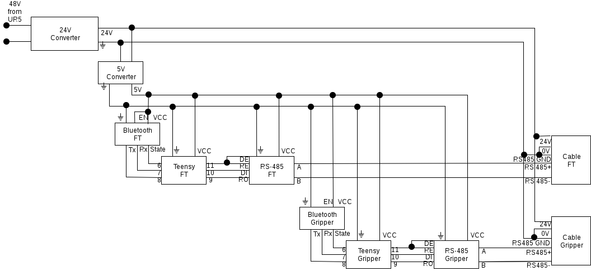
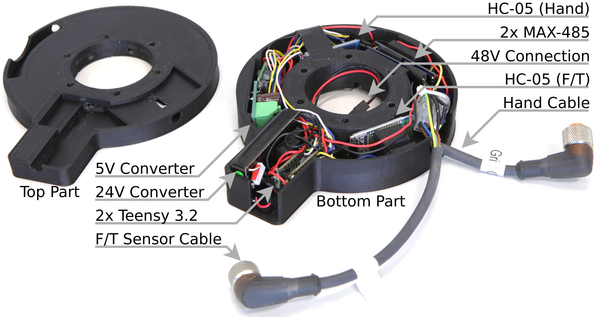

# Serial Bluetooth Connection for Robotique Gripper and FT Sensor

Since some robotic arms, like the UR5 do not provide a communication connection inside, it is necessary to lay the cables for connected grippers or sensors on the outside of the arm. This leads to entanglement and to unintented contact with other objects. We created a device which can be installed at the end of the arm and which provides multiple bluetooth connections, thus making the cables unnecessary.

The device is designed for the use of a UR5 with a Robotiq gripper and/or FT sensor but it can easily be altered for other arms and grippers.

The installed device between the gripper and the FT sensor.

The device consits of two 3D printed parts. One is holding all electronics and one is a simple lid. The electronics are described in the following part.
Up to two Bluetooth connections can be established which is necessary because the Robotiq gripper and FT sensor have the same ID but different baudrates and can therefore not be on the same bus.

## Electronics

Each Bluetooth connection is provided by a chain of a HC-05, a teensy 3.2 and a RS-485 converter. The teensy is serial connected the other two chips and handles the forwarding of bytes in both directions. The necessary code can be found [**here**](code).
Power is provided by the UR5 as 48V. A converter is needed since the gripper and sensor need 24V. Furthermore, 5V are needed for the electronics. Therefore two converters are integrated which provide 24V and 5V. The connections are shown below.

In order to save space, the two teensy and the RS-485 converters are soldered together as a pair. The HC-05 are not soldered together to prevent interferance. 
**Make sure that you programmed the HC-05 using the AT commands before you solder them (see next section).**

## Programming the HC-05

The HC-05 is programmed using AT commands. To be able to use them, we have to enter the AT mode. Do this by holding the button during power up. The LED should blink slowly afterwards. Now connect the HC-05 to a teensy and use the [**code**](code/at.arduino) to be able to send the AT commands. 

Open the seriel monitor with 9600 baud using both line endings. 

Test connection by sending only **AT**. The HC-05 should response with **OK**.

Now get the Bluetooth adress by using **AT+ADDR?**. Write it down, we will need it later.

Set the name to something usefull (linke "gripper") by using **AT+NAME=<Param>**.

Set the password by using **AT+PSWD=<Param>**.

Set the baudrate by using **AT+UART=<Param>,<Param2>,<Param3>**. Param1 is the baudrate, it should be 115200 for the gripper and 19200 for the sensor. Param2 is the stop bit, it has to be 0 for both. Param3 is the parity bit, it has to be 0 for both.

The HC-05 should now be programmed. Reconnect it to the power without holding the button to get it back into normal mode.

## 3D Printed Case

The case should be printed with enough infill (>=30%), since it has to be strong enough. We used ABS as material which worked very well but you can also try PLA if you want.
When assembling, first put all electronics inside. The planned positions of the chips are shown below. Then put the lid on it and use the vertical screws to connect the device to the FT sensor. Afterwards, put the gripper on top of it and use the horizontal screws to fix it.

## Serial Connection

With Linux it is possible to establish a serial connection via Bluetooth using **rfcomm**. First pair and trust the HC-05 with your computer (you can use blueman-manager if you want). Then bind the HC-05 to seriel devices using **rfcomm bind /dev/rfcomm1 BTADRESS**, where BTADRESS is your bluetooth adress which you noted during programming of the HC-05. You can also see it in the blueman-manager.
Do the same for the second HC-05 to /dev/rfcomm2 and remember which rfcomm is connected to which device.
Should you ever run into problems, use **rfcomm release all** to remove all seriel connections and then bind them again. You can see the current status using **rfcomm -a**.
If you want to send manual bytes over the serial connection for testing, you can use **minicom**.
Flash the [**test sketch**](code/test.arduino) on the teensy to test the connection. All incomming data from bluetooth will be displayed on the serial monitor.

## Troubleshooting

- First make sure that the Bluetooth adapter of the computer is as near as possible to the robotic arm and that it is not obstructed by anything.
- If the bluetooth connection stops to work, try **rfcomm release all** and rebinding of the devices.
- If you update your system to ubuntu 18.04, the default version of pymodbus install from `apt-get` does not work, use `pip install pymodbus==1.2.0` to downgrade it to version 1.2.0 in your local install.
- If you have any further errors (or problem solutions), please write issues or edit this file directly.
